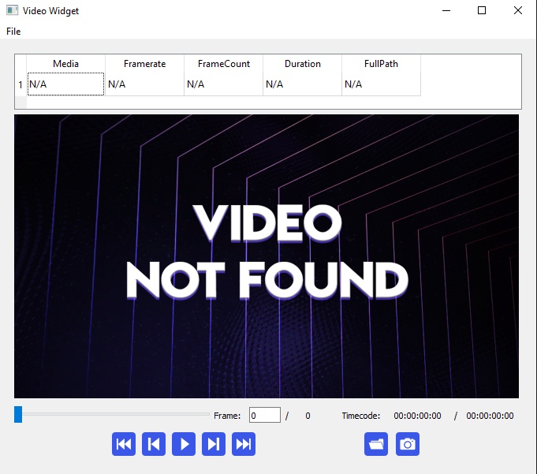
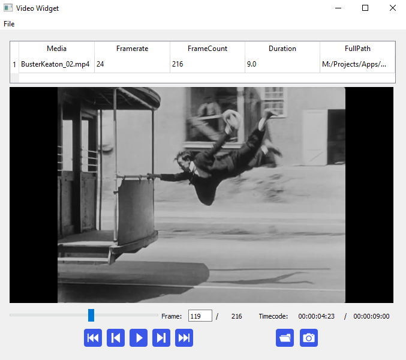

# Description

A Video Widget powered by QT and OpenCV (for frame processing)

# Requirements

- Pyside2

- PyQT5

- OpenCV2

# Usage

```py
from QTCV_VideoWidget.videoWidget.VideoWidget import VideoWidget
self.VideoWidget = VideoWidget(self)
self.ui.horizontalLayout.addWidget(self.VideoWidget)
```

```py
self.VideoWidget.loadFile('C:/temp/yt/file01.mp4')
```




